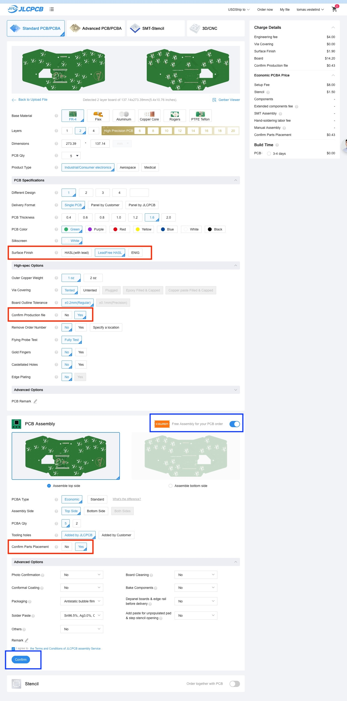
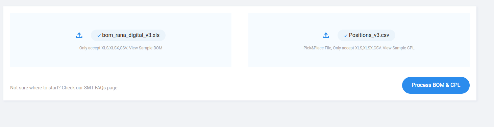
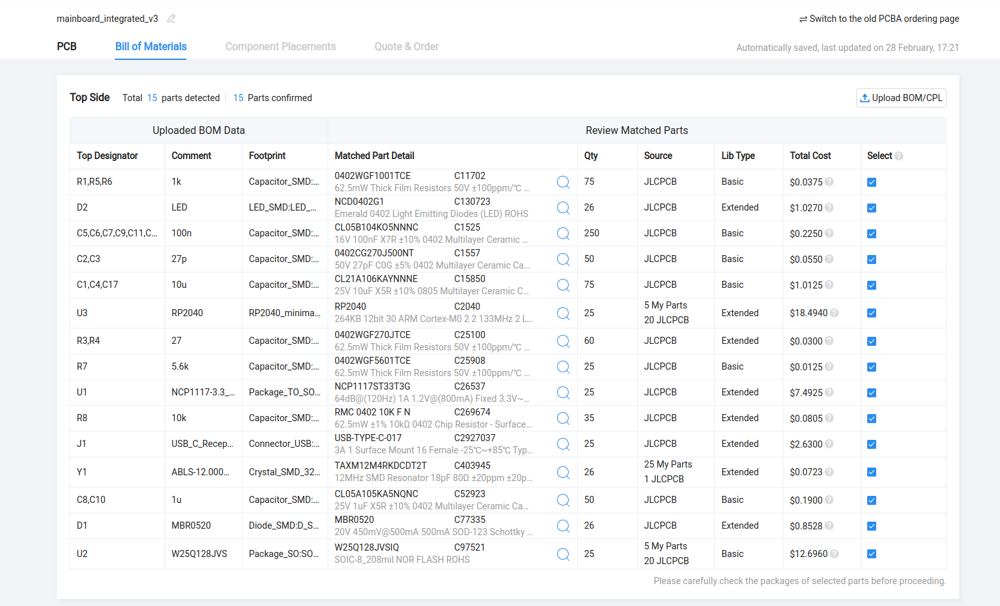
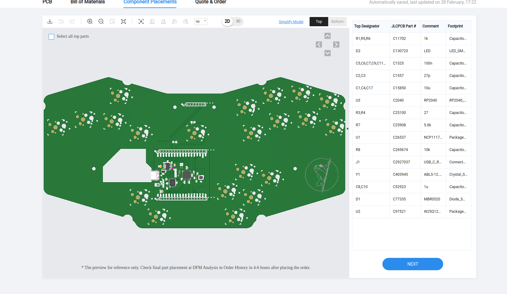

# Guide to ordering the parts for the Rana Digital

## PCBs

Here's how to order parts from JLCPBC. Head to [JLCPCB](https://jlcpcb.com/) and choose `Order now` from the menu.

You will need to order a [Mainboard](#mainboard) and a [RLUB](#rlub).

### Mainboard

#### Adding the Gerber file
Now we want to order `Standard PCB/PCBA` and we want to `Add gerber file` and that file is [mainboard\_integrated\_v3.zip](../Motherboard/Gerbers/mainboard_integrated_v3.zip).

#### Configuring the PCB
Here is a screenshot of how the options were filled in. I've added red squares in the places where I changed something.

#### Adding components
By checking `PCB Assembly` and pressing `Confirm` (which I've marked with blue squares) we can add components to the PCB.

##### Upload GOM and CPL files
After pressing `Confirm` we will get to a page where we will upload two files, [bom\_rana\_digital\_v3.xls](../Motherboard/Gerbers/bom_rana_digital_v3.xls) and [Positions\_v3.csv](../Motherboard/Gerbers/Positions_v3.csv).

##### Verifying that all components are in stock
After pressing `Process BOM & CPL` we'll have to confirm which components to use.

Here you might run into components which are not fully in stock. You will have to find a replacement by searching and choosing another component that is in stock. If that is to difficult then I recommend joining the Discord server at [https://discord.gg/9wBaMWgJkv](https://discord.gg/9wBaMWgJkv) and asking for help.

##### Verifying the end placement
After pressing `Next` you will see how everything will be placed.

##### Finishing up
After pressing `Next` again you will have to choose the type of PCB you are ordering. I chose `Programmable Controller`. After continuing the mainboard will be added to your shopping cart.

### RLUB

An ordering guide for the RLUB can be found in images found in [this repo](https://github.com/rana-sylvatica/RLUB).

## Chassis

## Keycaps

## Misc (hardware, switches, hotswap sockets, headers, etc.)

### Screws

https://www.mcmaster.com/92095A471/

### Threaded Standoffs

https://www.amazon.com/gp/product/B01N5TIG92

### Switches

https://flashquark.com/product/gateron-pro-switches-3-pin-plate-mount/

### Hotswap Sockets

https://www.amazon.com/gp/product/B096WZ6TJ5

### Male/Female Pin Headers

https://www.amazon.com/dp/B01461DQ6S
https://www.amazon.com/dp/B00R1M3JRQ
  